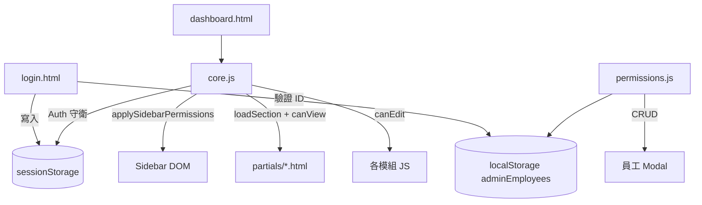

# 權限管理模組 — SDD 軟體設計規格書

> Yuruicamp 賣家後台新增「權限管理」模組：員工帳號管理、逐頁查看/編輯權限控管、Sidebar 灰階、登入驗證。  
> 版本：v1.0｜日期：2026-06-14

---

## 1. 專案背景與目標

### 1.1 背景

目前後台登入為 Mock 模式（任意帳密可進），所有登入者擁有相同功能，無法區分老闆與員工權限。

### 1.2 目標

| 優先順序 | 目標 |
|----------|------|
| 能跑 | 依員工 ID 登入，Sidebar 與頁面按鈕依權限顯示/停用 |
| 看懂 | 權限邏輯集中在 `core.js` + `permissions.js`，各模組只呼叫 helper |
| 好改 | `localStorage` 模擬，預留 REST API 接口 |
| 效能 | 最後才考慮（本模組無效能瓶頸） |

### 1.3 不在本版範圍

- 密碼加密與後端驗證（欄位保留，內容不驗證）
- 角色系統（已明確拿掉）
- 永久刪除員工（僅停用/啟用）
- 操作日誌 / 審計紀錄

---

## 2. 功能需求摘要

### 2.1 登入

| 規則 | 說明 |
|------|------|
| 欄位 | 員工 ID + 密碼（**兩者必填**） |
| 密碼驗證 | 第一版**不驗證內容**，只檢查非空 |
| ID 驗證 | 查 `localStorage.adminEmployees`，須存在且 `isActive: true` |
| 失敗提示 | 「帳號不存在或已停用」/ 「請輸入帳號」/ 「請輸入密碼」 |

### 2.2 員工身份

| 身份 | 欄位 | 權限 |
|------|------|------|
| 超級管理員 | `isSuperAdmin: true` | 9 頁全部 view+edit，矩陣鎖定 |
| 一般員工 | `isSuperAdmin: false` | 老闆逐頁勾選 view/edit |

### 2.3 超級管理員保護規則

- 不能停用自己
- 可停用其他超級管理員
- 系統至少保留 **1 位** `isActive: true` 的超級管理員
- 違反時顯示 Toast 錯誤，不執行操作

### 2.4 Sidebar 行為

| view 權限 | Sidebar 表現 |
|-----------|-------------|
| `true` | 正常可點 |
| `false` | 灰色 + `pointer-events: none` + `disabled` class |

### 2.5 頁面內行為

| view | edit | 行為 |
|------|------|------|
| false | — | 無法進入（Sidebar 已擋） |
| true | false | 可瀏覽資料；所有編輯按鈕 `disabled`，`title="無編輯權限"` |
| true | true | 完整功能 |

### 2.6 登入後預設首頁

依 Sidebar 順序，載入**第一個** `view: true` 的 section。

---

## 3. Sidebar 結構（最終版）

```
分析報表                          analytics
訂單管理                          orders
庫存異動紀錄                      movement
商品與庫存                        products
客戶管理                          customers
折扣管理                          discounts
評論管理                          reviews
────────── 分隔線 hr ──────────
預約/租借管理                     bookings
────────── 分隔線 hr ──────────
權限管理                          permissions   ← 新增
────────── footer ──────────
管理員名稱 + 登出
```

| 項目 | 值 |
|------|-----|
| 權限管理 icon | `fas fa-user-shield`（建議） |
| 權限管理 data-section | `permissions` |
| 權限管理 data-title | `權限管理` |

桌面版 Sidebar 與手機版 Offcanvas **結構一致**。

---

## 4. 權限矩陣（9 頁）

| key | 顯示名稱 | partial | init 函式 | 備註 |
|-----|----------|---------|-----------|------|
| `analytics` | 分析報表 | `analytics.html` | `initAnalytics` | 無編輯按鈕，edit 可保留欄位 |
| `orders` | 訂單管理 | `orders.html` | `initOrders` | 出貨按鈕 |
| `movement` | 庫存異動紀錄 | `movement.html` | `initMovement` | 僅查看/明細 |
| `products` | 商品與庫存 | `products.html` | `initProducts` | 新增/編輯/庫存 |
| `customers` | 客戶管理 | `customers.html` | `initCustomers` | inline 編輯 |
| `discounts` | 折扣管理 | `discounts.html` | `initDiscounts` | 新增/啟停/刪除 |
| `reviews` | 評論管理 | `reviews.html` | `initReviews` | 回覆 |
| `permissions` | 權限管理 | `permissions.html` | `initPermissions` | 僅超級管理員通常有權 |
| `bookings` | 預約/租借管理 | `bookings.html` | `initBookings` | 確認/取消/完成 |

### 4.1 權限連動規則（Modal 內）

```
勾選「編輯」→ 自動勾選「查看」
取消「查看」→ 自動取消「編輯」
超級管理員 → 全部勾選且 disabled（鎖定）
```

---

## 5. 資料模型

### 5.1 localStorage

| Key | 說明 |
|-----|------|
| `adminEmployees` | 員工陣列 JSON 字串 |

### 5.2 員工物件 Schema

```javascript
{
  "id": "02",                      // String，系統自動編號，不可改
  "displayName": "測試員工",        // Sidebar / Topbar 顯示
  "isSuperAdmin": false,
  "isActive": true,
  "createdAt": "2026-06-14",      // ISO 日期字串
  "permissions": {
    "analytics":   { "view": false, "edit": false },
    "orders":      { "view": true,  "edit": true  },
    "movement":    { "view": false, "edit": false },
    "products":    { "view": false, "edit": false },
    "customers":   { "view": true,  "edit": false },
    "discounts":   { "view": false, "edit": false },
    "reviews":     { "view": false, "edit": false },
    "permissions": { "view": false, "edit": false },
    "bookings":    { "view": false, "edit": false }
  }
}
```

### 5.3 初始種子資料

第一次讀取時若 `localStorage.adminEmployees` 不存在，寫入：

**`01` — 超級管理員**

```javascript
{
  id: "01",
  displayName: "王老闆",
  isSuperAdmin: true,
  isActive: true,
  createdAt: "2026-06-14",
  permissions: { /* 9 頁全部 view:true, edit:true */ }
}
```

**`02` — 一般員工（Demo 用）**

```javascript
{
  id: "02",
  displayName: "測試員工",
  isSuperAdmin: false,
  isActive: true,
  createdAt: "2026-06-14",
  permissions: {
    analytics:   { view: false, edit: false },
    orders:      { view: true,  edit: true  },
    movement:    { view: false, edit: false },
    products:    { view: false, edit: false },
    customers:   { view: true,  edit: false },  // 示範只能看
    discounts:   { view: false, edit: false },
    reviews:     { view: false, edit: false },
    permissions: { view: false, edit: false },
    bookings:    { view: false, edit: false }
  }
}
```

### 5.4 自動編號規則

```javascript
// 取現有 id 轉數字後 max+1，左側補零至 2 位（01~09）
// 超過 99 → "100", "101" ...
function getNextEmployeeId(employees) { ... }
```

### 5.5 sessionStorage（登入後）

| Key | 範例 | 說明 |
|-----|------|------|
| `adminLoggedIn` | `"true"` | 登入標記 |
| `adminId` | `"02"` | 員工編號 |
| `adminName` | `"測試員工"` | 顯示名稱 |
| `isSuperAdmin` | `"false"` | 字串 boolean |
| `adminPermissions` | `"{...}"` | JSON 字串 |

登出時**全部清除**（含上述 5 個 key）。

---

## 6. API 預留接口

```javascript
// --- API 預留（未來串接後端時替換 localStorage 邏輯）---
// GET    /api/admin/employees          → 取得員工列表
// POST   /api/admin/employees          → 新增員工
// PUT    /api/admin/employees/:id      → 更新員工（名稱、權限）
// PATCH  /api/admin/employees/:id/status → 停用/啟用
// POST   /api/admin/login              → 登入驗證（含密碼）
```

`permissions.js` 內封裝：

```javascript
function fetchEmployees() { /* localStorage → 未來 $.ajax */ }
function saveEmployees(list) { /* localStorage → 未來 $.ajax */ }
```

---

## 7. 架構設計

### 7.1 模組關係



### 7.2 core.js 新增全域 Helper

```javascript
// 從 sessionStorage 解析權限
window.getAdminPermissions = function () { ... };

// 檢查某 section 是否有查看/編輯權
window.canView = function (section) { ... };
window.canEdit = function (section) { ... };

// 依權限渲染 Sidebar（灰階 / 啟用）
window.applySidebarPermissions = function () { ... };

// 取得第一個可查看的 section（預設首頁）
window.getDefaultSection = function () { ... };

// 對某容器內所有編輯按鈕套用 disabled
window.applyEditPermission = function (section, $container) { ... };
```

### 7.3 loadSection() 修改

```javascript
function loadSection(sectionName) {
  // 1. 檢查 canView(sectionName)，無權限 → 顯示 alert + return
  // 2. 原有 AJAX 載入邏輯
  // 3. init 完成後呼叫 applyEditPermission(sectionName, $('#contentArea'))
}
```

### 7.4 initFunctions 擴充

```javascript
const initFunctions = {
  analytics:   window.initAnalytics,
  orders:      window.initOrders,
  movement:    window.initMovement,
  products:    window.initProducts,
  customers:   window.initCustomers,
  discounts:   window.initDiscounts,
  reviews:     window.initReviews,
  bookings:    window.initBookings,
  permissions: window.initPermissions,  // 新增
};
```

---

## 8. UI 規格 — 權限管理頁

### 8.1 列表區 `permissions.html`

```
┌──────────────────────────────────────────────────────────┐
│  權限管理                              [+ 新增員工]        │
├──────────────────────────────────────────────────────────┤
│  員工編號 │ 顯示名稱 │ 身份       │ 狀態 │ 操作          │
│  01      │ 王老闆   │ 超級管理員  │ 啟用 │ [編輯]        │
│  02      │ 測試員工 │ 一般員工    │ 啟用 │ [編輯][停用]  │
│  03      │ ...      │ 一般員工    │ 停用 │ [編輯][啟用]  │
└──────────────────────────────────────────────────────────┘
```

- 自己那一列：**不顯示**停用按鈕
- 超級管理員自己：**可編輯顯示名稱**，權限矩陣鎖定

### 8.2 新增/編輯 Modal

| 欄位 | 規則 |
|------|------|
| 員工編號 | 新增時自動顯示（readonly）；編輯時顯示既有 ID |
| 顯示名稱 | 必填 |
| 設為超級管理員 | Checkbox；勾選後權限矩陣全開鎖定 |
| 權限矩陣 | 9 行 × 查看/編輯 checkbox |
| 儲存 | 驗證顯示名稱非空；檢查超級管理員數量規則 |

### 8.3 進入權限管理頁的前置條件

- `canView('permissions') === true`（通常僅超級管理員）
- `canEdit('permissions') === false` 時：列表可見，但「新增員工」「編輯」「停用」按鈕 disabled

---

## 9. 各模組編輯按鈕對照表

實作 `applyEditPermission()` 或各模組 `init` 尾端呼叫：

| 模組 | 無 edit 時需 disabled 的元素 |
|------|------------------------------|
| `orders` | `.btn-ship-order` |
| `movement` | 無（純查看） |
| `products` | `#addProductBtn`、`.edit-product-btn`、`.stock-confirm-btn`、`.stock-step-btn`、`#submitAddProduct` |
| `customers` | `.tier-edit-btn`、`.points-edit-btn`、`.coupons-edit-btn` 及對應 save/cancel |
| `discounts` | `#submitAddCoupon`、`.btn-toggle-coupon`、`.btn-delete-coupon`、新增表單 input |
| `reviews` | `.btn-reply-toggle`、`.btn-submit-reply`、`textarea` |
| `bookings` | `.btn-confirm-booking`、`.btn-cancel-booking`、`#btnCompleteBooking`、`#equipmentReturnCheckbox` |
| `permissions` | `#addEmployeeBtn`、`.btn-edit-employee`、`.btn-toggle-employee`、Modal 內所有 input |
| `analytics` | 無編輯按鈕 |

---

## 10. CSS 規格

`admin/css/admin.css` 新增：

```css
/* 無查看權限的 Sidebar 連結 */
.sidebar-link.disabled {
  opacity: 0.4;
  pointer-events: none;
  cursor: not-allowed;
}

/* 無編輯權限的按鈕（各模組共用） */
.permission-readonly .btn:not(.btn-close):not([data-bs-dismiss]),
button[data-permission-disabled="true"] {
  /* 由 JS 設定 disabled + title */
}
```

---

## 11. 涉及檔案總覽

| 動作 | 檔案 | 說明 |
|------|------|------|
| **新增** | `plans/adminPermissions.md` | 本 SDD 文件 |
| **新增** | `admin/partials/permissions.html` | 權限管理頁面 |
| **新增** | `admin/js/permissions.js` | 員工 CRUD、種子初始化、權限矩陣 |
| 修改 | `admin/dashboard.html` | Sidebar 加權限管理 + hr + 引入 JS |
| 修改 | `admin/js/core.js` | 權限 helper、Sidebar、loadSection 守衛 |
| 修改 | `admin/login.html` | ID 驗證 localStorage、密碼必填不驗證 |
| 修改 | `admin/css/admin.css` | `.sidebar-link.disabled` |
| 修改 | `admin/js/orders.js` | applyEditPermission |
| 修改 | `admin/js/products.js` | applyEditPermission |
| 修改 | `admin/js/customers.js` | applyEditPermission |
| 修改 | `admin/js/discounts.js` | applyEditPermission |
| 修改 | `admin/js/reviews.js` | applyEditPermission |
| 修改 | `admin/js/bookings.js` | applyEditPermission |

---

## 12. 開發任務清單（建議順序）

### Task 1：`permissions.js` 資料層
- [ ] `ADMIN_SECTIONS` 常數（9 頁定義）
- [ ] `getDefaultPermissions(allTrue/allFalse)`
- [ ] `initEmployeeStore()` — 種子資料 `01`/`02`
- [ ] `fetchEmployees()` / `saveEmployees()`
- [ ] `getNextEmployeeId()`
- [ ] `findEmployeeById(id)`

### Task 2：`core.js` 權限核心
- [ ] `getAdminPermissions()` / `canView()` / `canEdit()`
- [ ] `applySidebarPermissions()`
- [ ] `getDefaultSection()`
- [ ] `applyEditPermission(section, $container)`
- [ ] 修改 `loadSection()` 加入 view 守衛
- [ ] 修改登出清除 5 個 sessionStorage key
- [ ] 註冊 `initPermissions`

### Task 3：`login.html` 登入改造
- [ ] 帳號欄 label 改為「員工 ID」（建議）
- [ ] 密碼必填、內容不驗證
- [ ] 驗證 ID 存在且 active
- [ ] 寫入 sessionStorage（5 keys）
- [ ] 更新 Demo 提示文字：`01` 老闆 / `02` 員工

### Task 4：`permissions.html` + `permissions.js` UI
- [ ] 員工列表渲染
- [ ] 新增/編輯 Modal + 權限矩陣
- [ ] 超級管理員鎖定邏輯
- [ ] 停用/啟用（含保護規則）
- [ ] `window.initPermissions()`

### Task 5：`dashboard.html` Sidebar
- [ ] 桌面版 + Offcanvas 加入權限管理
- [ ] 雙分隔線結構
- [ ] 引入 `permissions.js`

### Task 6：各模組 edit 權限
- [ ] orders / products / customers / discounts / reviews / bookings
- [ ] permissions 頁自身

### Task 7：`admin.css`
- [ ] `.sidebar-link.disabled` 樣式

### Task 8：手動測試

---

## 13. 測試計畫

| # | 步驟 | 預期結果 |
|---|------|----------|
| 1 | 登入 `01` + 任意密碼 | 進入分析報表，Sidebar 全亮 |
| 2 | 登入 `02` + 任意密碼 | 進入訂單管理；分析/折扣等灰色 |
| 3 | `02` 進客戶管理 | 可看資料；編輯鉛筆 disabled |
| 4 | `02` 進訂單管理 | 出貨按鈕可按 |
| 5 | `02` 點權限管理 | 灰色不可點 |
| 6 | `01` 進權限管理 → 修改 `02` 權限 | 登出再用 `02` 驗證 |
| 7 | `01` 新增 `03`，全不勾權限 | `03` 登入後 Sidebar 全灰（除可點的第一頁邏輯需處理：全灰則顯示提示頁） |
| 8 | `01` 停用最後一位其他超級管理員 | 允許（自己仍啟用） |
| 9 | 嘗試停用自己 `01` | 按鈕不存在或 Toast 阻擋 |
| 10 | 密碼留空登入 | 顯示「請輸入密碼」 |
| 11 | 登入 `99` | 「帳號不存在或已停用」 |

### 13.1 邊界：員工無任何 view 權限

`getDefaultSection()` 回傳 `null` 時，`#contentArea` 顯示：

> 「您目前沒有任何頁面權限，請聯絡管理員。」

---

## 14. 登入頁 Demo 提示（更新後）

```html
<small class="text-muted">
  <i class="fas fa-info-circle me-1"></i>
  Demo：員工 ID <code>01</code>（老闆）/ <code>02</code>（員工），密碼任意非空即可
</small>
```

---

## 15. 版本紀錄

| 版本 | 日期 | 說明 |
|------|------|------|
| v1.0 | 2026-06-14 | 初版 SDD，需求定稿 |
