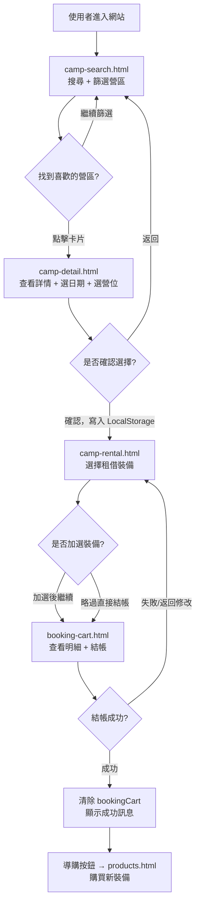
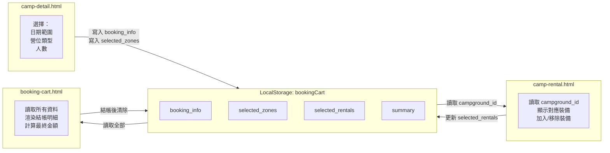

# 🏕️ Yuruicamp 露營電商平台
# 前端軟體設計規格書 (SDD)
## 功能模塊：營區預約 × 裝備租借整合系統

---

| 項目 | 內容 |
|------|------|
| **版本** | v1.0.0 |
| **建立日期** | 2026-06-11 |
| **狀態** | 🟡 草稿 Draft |
| **作者** | Yuruicamp 前端團隊 |
| **關聯專案** | Yuruicamp 露營選物電商平台 |

---

## 目錄

1. [系統概述](#1-系統概述)
2. [新增檔案清單](#2-新增檔案清單)
3. [頁面動線圖](#3-頁面動線圖)
4. [UI 設計規範](#4-ui-設計規範)
5. [各頁面詳細規格](#5-各頁面詳細規格)
   - 5.1 [camp-search.html — 營區搜尋與列表頁](#51-camp-searchhtml--營區搜尋與列表頁)
   - 5.2 [camp-detail.html — 營區詳情與預約頁](#52-camp-detailhtml--營區詳情與預約頁)
   - 5.3 [camp-rental.html — 裝備租借頁](#53-camp-rentalhtml--裝備租借頁)
   - 5.4 [booking-cart.html — 預約購物車與結帳頁](#54-booking-carthtml--預約購物車與結帳頁)
6. [資料結構定義 (Mock JSON)](#6-資料結構定義-mock-json)
7. [跨頁狀態管理 (LocalStorage)](#7-跨頁狀態管理-localstorage)
8. [程式碼慣例](#8-程式碼慣例)
9. [實作清單 (Checklist)](#9-實作清單-checklist)

---

## 1. 系統概述

### 1.1 目標說明

本模塊為 Yuruicamp 現有露營電商平台（裝備販售）的**擴充功能**，新增「營區預約」與「裝備租借 (Try-before-you-buy)」的完整服務流程。

使用者可以透過這套系統：
1. 搜尋並篩選合適的營區
2. 選擇入住日期、營位類型
3. 選配租借裝備
4. 完成結帳，並被導引購買自己喜歡的裝備

### 1.2 技術棧

| 技術 | 版本/說明 |
|------|-----------|
| HTML | HTML5 語意化標籤 |
| CSS | 自訂 CSS（沿用 `main.css` 變數系統），新增 `booking.css` |
| JavaScript | ES6+，搭配 jQuery 3.x |
| jQuery | CDN 引入，`$.ajax()` / `.load()` |
| 日期選擇器 | Flatpickr（CDN 引入，輕量、支援日期範圍選取） |
| 圖片佔位 | `https://picsum.photos` |

### 1.3 架構說明

```
架構類型：傳統多頁面 (Multi-page Application, MPA)
狀態管理：LocalStorage（跨頁傳遞預約資料）
資料來源：JSON Mock 檔案（保留 API 接口供未來 Java 後端對接）
```

### 1.4 與現有電商系統的整合關係

```
現有電商系統（裝備販售）
  └── pages/products.html   → 裝備購物
  └── pages/cart.html       → 購物車（電商）
  └── pages/checkout.html   → 結帳（電商）

新增預約系統（本規格書範疇）
  └── pages/camp-search.html   → 搜尋營區
  └── pages/camp-detail.html   → 選擇日期 + 營位
  └── pages/camp-rental.html   → 加選租借裝備
  └── pages/booking-cart.html  → 預約結帳（獨立購物車）
       └── 結帳後 → 導購按鈕 → 回到 pages/products.html
```

> **重點**：預約系統使用**獨立的 LocalStorage key** (`bookingCart`)，與電商購物車 (`cart`) **完全分離**，互不干擾。

---

## 2. 新增檔案清單

依循現有專案目錄慣例，所有新增檔案位置如下：

```
Yuruicamp/
│
├── pages/                        ← HTML 頁面（新增 4 個）
│   ├── camp-search.html          ★ 營區搜尋與列表頁
│   ├── camp-detail.html          ★ 營區詳情與營位預約頁
│   ├── camp-rental.html          ★ 裝備租借頁
│   └── booking-cart.html         ★ 預約購物車與結帳頁
│
├── js/
│   └── pages/                    ← 各頁面專屬 JS（新增 4 個）
│       ├── camp-search.js        ★ 搜尋篩選邏輯
│       ├── camp-detail.js        ★ 日期選擇 + 庫存連動
│       ├── camp-rental.js        ★ 裝備推薦 + 租借計費
│       └── booking-cart.js       ★ 結帳頁邏輯
│
├── data/                         ← Mock JSON 資料（新增 2 個）
│   ├── campgrounds.json          ★ 營區 + 營位資料
│   └── rentals.json              ★ 租借裝備資料
│
└── css/
    └── booking.css               ★ 預約系統專屬樣式
```

---

## 3. 頁面動線圖

### 3.1 主要使用者流程



### 3.2 LocalStorage 資料流



---

## 4. UI 設計規範

### 4.1 色彩系統

沿用 `color/color.md` 定義的品牌色彩，在 `booking.css` 中以 CSS 自訂屬性實作：

```css
/* booking.css 頂部色彩變數定義 */
:root {
  --color-primary:     #244d4d;  /* 深青綠：主色、按鈕、標題 */
  --color-primary-hover: #316868; /* 深青綠懸停色：按鈕 hover */
  --color-white:       #ffffff;  /* 純白：背景、按鈕文字 */
  --color-light-accent:#779977;  /* 淺青灰綠：連結、副標題 */
  --color-bg:          #f6fbf6;  /* 淺綠背景：頁面底色 */
  --color-card-bg:     #f2f2f2;  /* 淺灰：卡片背景 */
  --color-highlight:   gold;     /* 金色：評分星星 */
  --color-warning:     #e07b39;  /* 橘色：推薦標籤、警示 */
  --color-border:      0.1rem solid #244d4d;
  --box-shadow:        0.5rem 1rem rgba(0, 0, 0, 0.1);
}
```

### 4.2 版面佈局（RWD）

**桌面版（≥ 768px）：雙欄佈局**
```
┌─────────────────────────────────────────────────┐
│  Header (共用 components/header.html)            │
├───────────────┬─────────────────────────────────┤
│  左欄         │  右欄                            │
│  篩選器       │  營區卡片 Grid                   │
│  (280px 固定) │  (剩餘寬度，2~3 欄)              │
│               │                                  │
├───────────────┴─────────────────────────────────┤
│  Footer (共用 components/footer.html)            │
└─────────────────────────────────────────────────┘
```

**行動版（< 768px）：單欄 + 收合篩選**
```
┌───────────────────────────────┐
│  Header                       │
├───────────────────────────────┤
│  [🔍 展開篩選器] 按鈕         │
│  ↓（展開時）篩選器抽屜        │
├───────────────────────────────┤
│  營區卡片 (1 欄)              │
├───────────────────────────────┤
│  Footer                       │
└───────────────────────────────┘
```

### 4.3 共用元件規格

| 元件 | 說明 |
|------|------|
| Header | `<div id="header"></div>` + JS 動態 `.load('../components/header.html')` |
| Footer | `<div id="footer"></div>` + JS 動態 `.load('../components/footer.html')` |
| Toast 通知 | 沿用現有 `js/components/toast.js` |
| 圖示 | Bootstrap Icons CDN（`bi-*` class） |
| 日期選擇器 | Flatpickr CDN（`camp-detail.html` 專用） |

### 4.4 營區卡片元件規格

```html
<!-- 營區卡片 Card Component 結構 -->
<div class="camp-card"
     data-id="C001"
     data-region="北部"
     data-env="高海拔,有雲海,森林系"
     data-facility="獨立衛浴,裝備租借">

  <div class="camp-card__image">
    
    <span class="camp-card__badge">北部</span>
  </div>

  <div class="camp-card__body">
    <h3 class="camp-card__name">雲海仙境露營區</h3>
    <p class="camp-card__price">平日 NT$1,000 / 假日 NT$1,500 起</p>
    <div class="camp-card__tags">
      <span class="tag tag--env">高海拔</span>
      <span class="tag tag--env">有雲海</span>
      <span class="tag tag--facility">裝備租借</span>
    </div>
  </div>

  <div class="camp-card__footer">
    <a href="camp-detail.html?id=C001" class="btn btn--primary">查看詳情</a>
  </div>

</div>
```

---

## 5. 各頁面詳細規格

---

### 5.1 `camp-search.html` — 營區搜尋與列表頁

#### 頁面目標
提供使用者搜尋、瀏覽、篩選所有可預約的營區。

#### HTML 結構

```html
<!DOCTYPE html>
<html lang="zh-TW">
<head>
  <meta charset="UTF-8">
  <meta name="viewport" content="width=device-width, initial-scale=1.0">
  <title>搜尋營區 - Yuruicamp</title>
  <link rel="stylesheet" href="../css/main.css">
  <link rel="stylesheet" href="../css/booking.css">
  <link href="https://cdn.jsdelivr.net/npm/bootstrap-icons@1.10.5/font/bootstrap-icons.css" rel="stylesheet">
</head>
<body>

  <div id="header"></div>

  <main class="search-page">

    <!-- 頂部搜尋列 / Top Search Bar -->
    <section class="search-bar-section">
      <div class="search-bar">
        <input type="date" id="checkInDate"  class="search-bar__input" placeholder="入住日期">
        <input type="date" id="checkOutDate" class="search-bar__input" placeholder="退房日期">
        <select id="guestCount" class="search-bar__select">
          <option value="">人數</option>
          <option value="1">1 人</option>
          <option value="2">2 人</option>
          <option value="4">4 人</option>
          <option value="6">6 人以上</option>
        </select>
        <select id="regionFilter" class="search-bar__select">
          <option value="">所有地區</option>
          <option value="北部">北部</option>
          <option value="中部">中部</option>
          <option value="南部">南部</option>
          <option value="東部">東部</option>
        </select>
        <button id="searchBtn" class="btn btn--primary">
          <i class="bi bi-search"></i> 搜尋
        </button>
      </div>
    </section>

    <!-- 主內容區：左側篩選 + 右側卡片 / Main: Sidebar + Card Grid -->
    <div class="search-layout">

      <!-- 左側篩選器 / Left Sidebar Filter -->
      <aside class="filter-sidebar">

        <!-- 行動版展開按鈕 / Mobile toggle button -->
        <button class="filter-sidebar__toggle" id="filterToggle">
          <i class="bi bi-funnel"></i> 篩選條件
        </button>

        <div class="filter-sidebar__body" id="filterBody">

          <!-- 篩選區塊：環境特徵 / Filter Group: Environment -->
          <div class="filter-group">
            <h4 class="filter-group__title">環境特徵</h4>
            <label><input type="checkbox" name="env" value="高海拔"> 高海拔</label>
            <label><input type="checkbox" name="env" value="低海拔"> 低海拔</label>
            <label><input type="checkbox" name="env" value="有雲海"> 有雲海</label>
            <label><input type="checkbox" name="env" value="有溪流"> 有溪流</label>
            <label><input type="checkbox" name="env" value="森林系"> 森林系</label>
          </div>

          <!-- 篩選區塊：營區設施 / Filter Group: Facility -->
          <div class="filter-group">
            <h4 class="filter-group__title">營區設施</h4>
            <label><input type="checkbox" name="facility" value="有雨棚"> 有雨棚</label>
            <label><input type="checkbox" name="facility" value="裝備租借"> 裝備租借</label>
            <label><input type="checkbox" name="facility" value="小木屋"> 小木屋</label>
            <label><input type="checkbox" name="facility" value="寵物友善"> 寵物友善</label>
            <label><input type="checkbox" name="facility" value="兒童遊樂設施"> 兒童遊樂設施</label>
            <label><input type="checkbox" name="facility" value="獨立衛浴"> 獨立衛浴</label>
            <label><input type="checkbox" name="facility" value="可包區"> 可包區</label>
          </div>

          <button id="resetFilterBtn" class="btn btn--outline">重設篩選</button>

        </div>
      </aside>

      <!-- 右側：搜尋結果 / Right: Search Results -->
      <section class="search-results">
        <div class="search-results__header">
          <p id="resultCount">共 0 個營區</p>
          <!-- 未來擴充：排序下拉選單 -->
        </div>
        <!-- 卡片容器，由 jQuery 動態填充 / Card container, filled by jQuery -->
        <div class="camp-card-grid" id="campCardGrid">
          <!-- 讀取中骨架屏 / Loading skeleton -->
          <div class="loading-skeleton" id="loadingSkeleton">載入中...</div>
        </div>
      </section>

    </div>

  </main>

  <div id="footer"></div>

  <!-- 依賴順序：jQuery → 工具函式 → 頁面邏輯 -->
  <script src="https://code.jquery.com/jquery-3.7.1.min.js"></script>
  <script src="../js/main.js"></script>
  <script src="../js/pages/camp-search.js"></script>

</body>
</html>
```

#### `camp-search.js` 完整邏輯流程

```javascript
/**
 * camp-search.js
 * 負責：① 讀取 JSON → ② 渲染卡片 → ③ 即時篩選
 */

// ============================================================
// 全域狀態
// ============================================================
let allCampgrounds = [];  // 原始資料快取 / Raw data cache

// ============================================================
// 步驟 1：頁面載入後，立即讀取營區資料
// ============================================================
$(document).ready(function () {

  // TODO: 未來在此替換為 fetch Java 後端 API
  // 未來後端接口：GET /api/campgrounds?region=&env=&facility=
  $.ajax({
    url: '../data/campgrounds.json',
    method: 'GET',
    dataType: 'json',
    success: function (data) {
      allCampgrounds = data;           // 快取原始資料
      renderCampCards(allCampgrounds); // 渲染所有卡片
    },
    error: function () {
      $('#campCardGrid').html('<p class="error-msg">營區資料載入失敗，請稍後再試。</p>');
    }
  });

  // ============================================================
  // 步驟 2：綁定篩選器事件（Checkbox 變更 → 觸發過濾）
  // ============================================================
  $('input[name="env"], input[name="facility"]').on('change', filterCampgrounds);
  $('#regionFilter').on('change', filterCampgrounds);

  // 重設按鈕
  $('#resetFilterBtn').on('click', function () {
    $('input[type="checkbox"]').prop('checked', false);
    $('#regionFilter').val('');
    filterCampgrounds();
  });

  // 行動版篩選器展開/收合
  $('#filterToggle').on('click', function () {
    $('#filterBody').toggleClass('is-open');
  });

});

// ============================================================
// 步驟 3：渲染卡片函式
// ============================================================
/**
 * 將營區資料陣列渲染為 HTML 卡片，並插入 DOM
 * @param {Array} camps - 營區資料陣列
 */
function renderCampCards(camps) {
  $('#loadingSkeleton').hide();
  const $grid = $('#campCardGrid');
  $grid.empty();

  if (camps.length === 0) {
    $grid.html('<p class="no-result">沒有符合條件的營區，請調整篩選條件。</p>');
    $('#resultCount').text('共 0 個營區');
    return;
  }

  camps.forEach(function (camp) {
    // 計算最低價格（所有 zone 中最低的平日價）
    const minPrice = Math.min(...camp.zones.map(z => z.price_weekday));
    const maxHolidayPrice = Math.max(...camp.zones.map(z => z.price_holiday));

    // 渲染環境標籤
    const envTags = camp.environment_tags.map(t =>
      `<span class="tag tag--env">${t}</span>`
    ).join('');

    // 渲染設施標籤（最多顯示 3 個）
    const facilityTags = camp.facility_tags.slice(0, 3).map(t =>
      `<span class="tag tag--facility">${t}</span>`
    ).join('');

    const cardHTML = `
      <div class="camp-card"
           data-id="${camp.campground_id}"
           data-region="${camp.region}"
           data-env="${camp.environment_tags.join(',')}"
           data-facility="${camp.facility_tags.join(',')}">
        <div class="camp-card__image">
          
          <span class="camp-card__badge">${camp.region}</span>
        </div>
        <div class="camp-card__body">
          <h3 class="camp-card__name">${camp.name}</h3>
          <p class="camp-card__price">
            平日 NT$${minPrice.toLocaleString()} ～ 假日 NT$${maxHolidayPrice.toLocaleString()} 起
          </p>
          <div class="camp-card__tags">${envTags}${facilityTags}</div>
        </div>
        <div class="camp-card__footer">
          <a href="camp-detail.html?id=${camp.campground_id}" class="btn btn--primary">
            查看詳情 <i class="bi bi-arrow-right"></i>
          </a>
        </div>
      </div>
    `;
    $grid.append(cardHTML);
  });

  $('#resultCount').text(`共 ${camps.length} 個營區`);
}

// ============================================================
// 步驟 4：篩選邏輯（AND 多條件，全部符合才顯示）
// ============================================================
/**
 * 讀取所有勾選的 Checkbox 與下拉選單，過濾 allCampgrounds
 * 篩選規則：AND（勾選的每個條件都必須滿足）
 */
function filterCampgrounds() {
  // 取得勾選的環境標籤
  const checkedEnv = $('input[name="env"]:checked').map(function () {
    return $(this).val();
  }).get();

  // 取得勾選的設施標籤
  const checkedFacility = $('input[name="facility"]:checked').map(function () {
    return $(this).val();
  }).get();

  // 取得地區篩選值
  const selectedRegion = $('#regionFilter').val();

  // 過濾
  const filtered = allCampgrounds.filter(function (camp) {
    // 地區篩選：未選則略過 / Region filter: skip if not selected
    if (selectedRegion && camp.region !== selectedRegion) return false;

    // 環境標籤：勾選的每一項都必須包含在 camp.environment_tags 裡
    const envMatch = checkedEnv.every(tag => camp.environment_tags.includes(tag));
    if (!envMatch) return false;

    // 設施標籤：勾選的每一項都必須包含在 camp.facility_tags 裡
    const facilityMatch = checkedFacility.every(tag => camp.facility_tags.includes(tag));
    if (!facilityMatch) return false;

    return true;
  });

  renderCampCards(filtered);
}
```

---

### 5.2 `camp-detail.html` — 營區詳情與預約頁

#### 頁面目標
展示單一營區的詳細資訊，讓使用者選擇入住日期、選擇營位類型，並將預約資訊存入 LocalStorage。

#### URL 傳參規則

```
camp-detail.html?id=C001
                    ↑ campground_id，由搜尋頁卡片連結傳入
```

#### HTML 結構

```html
<!DOCTYPE html>
<html lang="zh-TW">
<head>
  <meta charset="UTF-8">
  <meta name="viewport" content="width=device-width, initial-scale=1.0">
  <title>營區詳情 - Yuruicamp</title>
  <link rel="stylesheet" href="../css/main.css">
  <link rel="stylesheet" href="../css/booking.css">
  <!-- Flatpickr 日期選擇器 CSS / Flatpickr datepicker CSS -->
  <link rel="stylesheet" href="https://cdn.jsdelivr.net/npm/flatpickr/dist/flatpickr.min.css">
  <link href="https://cdn.jsdelivr.net/npm/bootstrap-icons@1.10.5/font/bootstrap-icons.css" rel="stylesheet">
</head>
<body>

  <div id="header"></div>

  <main class="detail-page">

    <!-- 麵包屑導航 / Breadcrumb -->
    <nav class="breadcrumb">
      <a href="camp-search.html">搜尋營區</a>
      <span> / </span>
      <span id="breadcrumbName">載入中...</span>
    </nav>

    <!-- 營區標題區 / Camp Header -->
    <section class="camp-header" id="campHeader">
      <!-- 由 jQuery 動態填充 / Dynamically filled by jQuery -->
    </section>

    <!-- 主內容：左側資訊 + 右側預約表單 -->
    <div class="detail-layout">

      <!-- 左側：營區介紹 / Left: Camp Info -->
      <div class="camp-info">
        <div class="camp-gallery" id="campGallery">
          <!-- 圖片輪播 -->
        </div>
        <div class="camp-description" id="campDescription">
          <!-- 介紹文字、設施標籤 -->
        </div>
      </div>

      <!-- 右側：預約表單 / Right: Booking Form -->
      <aside class="booking-form-card">
        <h2 class="booking-form-card__title">選擇日期與營位</h2>

        <!-- 日期範圍選擇器 (Flatpickr) -->
        <div class="form-group">
          <label for="dateRange">入住 → 退房日期</label>
          <input type="text" id="dateRange" class="form-control" placeholder="選擇日期範圍">
        </div>

        <!-- 日期計算結果顯示 / Date calculation result -->
        <div class="date-summary" id="dateSummary" style="display:none">
          <p>總天數：<strong id="totalDays">0</strong> 晚</p>
          <p>平日：<strong id="weekdayCount">0</strong> 晚（每晚 NT$--）</p>
          <p>假日：<strong id="holidayCount">0</strong> 晚（每晚 NT$--）</p>
        </div>

        <!-- 營位類型選擇 / Zone Type Selection -->
        <div class="form-group">
          <label>選擇營位類型</label>
          <div class="zone-list" id="zoneList">
            <!-- 由 jQuery 動態渲染 / Dynamically rendered by jQuery -->
          </div>
        </div>

        <!-- 人數 -->
        <div class="form-group">
          <label for="guestNum">人數</label>
          <input type="number" id="guestNum" class="form-control"
                 min="1" max="20" value="2" placeholder="請輸入人數">
        </div>

        <!-- 費用小計 / Price Summary -->
        <div class="price-summary" id="priceSummary" style="display:none">
          <p class="price-summary__label">住宿費小計</p>
          <p class="price-summary__amount" id="zonePriceTotal">NT$0</p>
        </div>

        <!-- 確認按鈕 / Confirm Button -->
        <button class="btn btn--primary btn--full" id="confirmBookingBtn" disabled>
          下一步：選擇租借裝備 <i class="bi bi-arrow-right"></i>
        </button>
        <p class="booking-form-card__hint">確認後可加選租借裝備，也可直接前往結帳。</p>

      </aside>

    </div>

    <!-- 營位資訊表格 / Zone Info Table -->
    <section class="zone-table-section">
      <h3>營位類型詳細資訊</h3>
      <table class="zone-table" id="zoneTable">
        <thead>
          <tr>
            <th>類型</th><th>容納人數</th><th>平日價</th><th>假日價</th><th>剩餘數量</th>
          </tr>
        </thead>
        <tbody id="zoneTableBody">
          <!-- 由 jQuery 動態渲染 -->
        </tbody>
      </table>
    </section>

  </main>

  <div id="footer"></div>

  <script src="https://code.jquery.com/jquery-3.7.1.min.js"></script>
  <!-- Flatpickr JS + 繁中語系 / Flatpickr JS + Traditional Chinese locale -->
  <script src="https://cdn.jsdelivr.net/npm/flatpickr"></script>
  <script src="https://cdn.jsdelivr.net/npm/flatpickr/dist/l10n/zh-tw.js"></script>
  <script src="../js/main.js"></script>
  <script src="../js/pages/camp-detail.js"></script>

</body>
</html>
```

#### `camp-detail.js` 完整邏輯流程

```javascript
/**
 * camp-detail.js
 * 負責：① URL 讀取 id → ② 渲染詳情 → ③ 日期選擇計算 → ④ 寫入 LocalStorage
 */

// ============================================================
// 全域狀態
// ============================================================
let currentCamp = null;      // 當前營區資料
let selectedZoneId = null;   // 使用者選擇的 zone_id
let checkInDate  = null;     // 入住日期 (Date 物件)
let checkOutDate = null;     // 退房日期 (Date 物件)
let weekdayCount = 0;        // 平日天數
let holidayCount = 0;        // 假日天數

// ============================================================
// 步驟 1：從 URL 取得 campground_id
// ============================================================
$(document).ready(function () {

  // 解析 URL 參數：?id=C001
  const params = new URLSearchParams(window.location.search);
  const campId = params.get('id');

  if (!campId) {
    alert('找不到營區 ID，將返回搜尋頁。');
    window.location.href = 'camp-search.html';
    return;
  }

  // TODO: 未來在此替換為 fetch Java 後端 API
  // 未來後端接口：GET /api/campgrounds/{campId}
  $.ajax({
    url: '../data/campgrounds.json',
    method: 'GET',
    dataType: 'json',
    success: function (data) {
      // 從陣列中找到對應的營區
      currentCamp = data.find(c => c.campground_id === campId);
      if (!currentCamp) {
        alert('找不到此營區，將返回搜尋頁。');
        window.location.href = 'camp-search.html';
        return;
      }
      renderCampDetail(currentCamp);  // 渲染頁面
    },
    error: function () {
      alert('資料載入失敗，請稍後再試。');
    }
  });

  // 綁定確認按鈕
  $('#confirmBookingBtn').on('click', saveToLocalStorageAndNext);

});

// ============================================================
// 步驟 2：初始化 Flatpickr 日期範圍選擇器
// ============================================================
function initDatePicker() {
  flatpickr('#dateRange', {
    mode: 'range',            // 範圍模式 / Range mode
    locale: 'zh_tw',          // 繁中語系
    minDate: 'today',         // 最早只能選今天 / Min selectable: today
    dateFormat: 'Y-m-d',
    onChange: function (selectedDates) {
      if (selectedDates.length === 2) {
        checkInDate  = selectedDates[0];
        checkOutDate = selectedDates[1];
        calculateDays(checkInDate, checkOutDate);
        updatePriceSummary();
      }
    }
  });
}

// ============================================================
// 步驟 3：計算平日/假日天數
// ============================================================
/**
 * 計算日期區間內的平日與假日數量
 * 規則：週五 (5) 與週六 (6) 算「假日」，其餘算「平日」
 *
 * Calculate weekdays and holidays in a date range.
 * Rule: Friday (5) and Saturday (6) = holiday; others = weekday
 *
 * @param {Date} start - 入住日期
 * @param {Date} end   - 退房日期
 */
function calculateDays(start, end) {
  weekdayCount = 0;
  holidayCount = 0;

  // 逐天計算：從入住日（含）到退房日（不含，因為退房日當天不住）
  const current = new Date(start);
  while (current < end) {
    const dayOfWeek = current.getDay(); // 0=日, 1=一, ..., 5=五, 6=六
    if (dayOfWeek === 5 || dayOfWeek === 6) {
      holidayCount++;
    } else {
      weekdayCount++;
    }
    current.setDate(current.getDate() + 1);
  }

  const totalDays = weekdayCount + holidayCount;

  // 更新 UI 顯示
  $('#totalDays').text(totalDays);
  $('#weekdayCount').text(weekdayCount);
  $('#holidayCount').text(holidayCount);
  $('#dateSummary').show();
}

// ============================================================
// 步驟 4：渲染營區詳情
// ============================================================
function renderCampDetail(camp) {

  // 更新頁面標題
  document.title = `${camp.name} - Yuruicamp`;
  $('#breadcrumbName').text(camp.name);

  // 渲染 Header 區塊
  const envTagsHTML  = camp.environment_tags.map(t => `<span class="tag tag--env">${t}</span>`).join('');
  const facTagsHTML  = camp.facility_tags.map(t => `<span class="tag tag--facility">${t}</span>`).join('');
  $('#campHeader').html(`
    <h1>${camp.name}</h1>
    <p class="camp-header__region"><i class="bi bi-geo-alt"></i> ${camp.region}</p>
    <div class="camp-header__tags">${envTagsHTML}${facTagsHTML}</div>
  `);

  // 渲染圖片（使用 picsum 佔位）
  const galleryHTML = [0, 1, 2].map(i =>
    ``
  ).join('');
  $('#campGallery').html(galleryHTML);

  // 渲染營位選擇器
  renderZoneSelector(camp.zones);

  // 渲染詳細資訊表格
  renderZoneTable(camp.zones);

  // 初始化日期選擇器
  initDatePicker();
}

// ============================================================
// 步驟 5：渲染營位選擇卡
// ============================================================
function renderZoneSelector(zones) {
  const $list = $('#zoneList').empty();
  zones.forEach(function (zone) {
    const card = `
      <div class="zone-card" data-zone-id="${zone.zone_id}">
        <div class="zone-card__info">
          <strong>${zone.type}</strong>
          <span>最多 ${zone.capacity_per_site} 人</span>
        </div>
        <div class="zone-card__price">
          平日 NT$${zone.price_weekday} ／ 假日 NT$${zone.price_holiday}
        </div>
        <div class="zone-card__stock">
          剩餘 <strong>${zone.total_sites}</strong> 個營位
        </div>
        <button class="btn btn--outline zone-select-btn">選擇此類型</button>
      </div>
    `;
    $list.append(card);
  });

  // 綁定選擇事件 / Bind zone selection event
  $list.on('click', '.zone-select-btn', function () {
    const $card = $(this).closest('.zone-card');
    $('.zone-card').removeClass('is-selected');
    $card.addClass('is-selected');
    selectedZoneId = $card.data('zone-id');
    $(this).text('✓ 已選擇');
    updatePriceSummary();
  });
}

// ============================================================
// 步驟 6：更新費用小計
// ============================================================
function updatePriceSummary() {
  if (!selectedZoneId || (!weekdayCount && !holidayCount)) return;

  const zone = currentCamp.zones.find(z => z.zone_id === selectedZoneId);
  if (!zone) return;

  // 計算：(平日價 × 平日天數) + (假日價 × 假日天數)
  const subtotal = (zone.price_weekday * weekdayCount) + (zone.price_holiday * holidayCount);

  $('#zonePriceTotal').text(`NT$${subtotal.toLocaleString()}`);
  $('#priceSummary').show();
  // 啟用下一步按鈕
  $('#confirmBookingBtn').prop('disabled', false);

  // 更新平假日單價顯示
  $('#weekdayCount').closest('p').text(
    `平日：${weekdayCount} 晚（每晚 NT$${zone.price_weekday}）`
  );
  $('#holidayCount').closest('p').text(
    `假日：${holidayCount} 晚（每晚 NT$${zone.price_holiday}）`
  );
}

// ============================================================
// 步驟 7：儲存至 LocalStorage 並前往下一頁
// ============================================================
function saveToLocalStorageAndNext() {
  const zone = currentCamp.zones.find(z => z.zone_id === selectedZoneId);
  if (!zone) return;

  const subtotal = (zone.price_weekday * weekdayCount) + (zone.price_holiday * holidayCount);
  const totalDays = weekdayCount + holidayCount;

  // 建立 bookingCart 資料結構
  const bookingCart = {
    booking_info: {
      campground_id:  currentCamp.campground_id,
      campground_name: currentCamp.name,
      check_in:       formatDate(checkInDate),
      check_out:      formatDate(checkOutDate),
      total_days:     totalDays,
      weekday_count:  weekdayCount,
      holiday_count:  holidayCount,
      guest_count:    parseInt($('#guestNum').val()) || 2
    },
    selected_zones: [
      {
        zone_id:   zone.zone_id,
        zone_type: zone.type,
        quantity:  1,
        subtotal:  subtotal
      }
    ],
    selected_rentals: [],  // 下一頁（camp-rental）填充
    summary: {
      zone_total:       subtotal,
      rental_total:     0,
      applied_discount: 0,
      final_amount:     subtotal
    }
  };

  // 寫入 LocalStorage
  localStorage.setItem('bookingCart', JSON.stringify(bookingCart));

  // 前往下一頁
  window.location.href = `camp-rental.html`;
}

// ============================================================
// 工具函式：Date → 'YYYY-MM-DD'
// ============================================================
function formatDate(date) {
  const y = date.getFullYear();
  const m = String(date.getMonth() + 1).padStart(2, '0');
  const d = String(date.getDate()).padStart(2, '0');
  return `${y}-${m}-${d}`;
}
```

---

### 5.3 `camp-rental.html` — 裝備租借頁

#### 頁面目標
根據使用者選擇的營區，顯示該營區的專屬租借裝備，並支援加入/移除，最終更新 LocalStorage。

#### HTML 結構

```html
<!DOCTYPE html>
<html lang="zh-TW">
<head>
  <meta charset="UTF-8">
  <meta name="viewport" content="width=device-width, initial-scale=1.0">
  <title>選擇租借裝備 - Yuruicamp</title>
  <link rel="stylesheet" href="../css/main.css">
  <link rel="stylesheet" href="../css/booking.css">
  <link href="https://cdn.jsdelivr.net/npm/bootstrap-icons@1.10.5/font/bootstrap-icons.css" rel="stylesheet">
</head>
<body>

  <div id="header"></div>

  <main class="rental-page">

    <!-- 頂部預約摘要列 / Booking Summary Bar -->
    <div class="booking-summary-bar" id="bookingSummaryBar">
      <!-- jQuery 讀取 LocalStorage 後動態填充 -->
      <!-- 顯示：營區名稱、日期、天數 -->
    </div>

    <!-- 情境推薦橫幅 / Context Recommendation Banner -->
    <div class="recommendation-banner" id="recommendationBanner">
      <!-- 依據 environment_tags 動態顯示推薦提示 -->
    </div>

    <!-- 主內容：裝備列表 + 右側租借清單 -->
    <div class="rental-layout">

      <!-- 左側：可租借裝備列表 -->
      <section class="rental-items-list">
        <h2>可租借裝備</h2>
        <div class="rental-grid" id="rentalGrid">
          <!-- jQuery 動態渲染裝備卡片 -->
        </div>
      </section>

      <!-- 右側：已選租借清單 + 費用 / Right: Selected Rentals + Cost -->
      <aside class="rental-cart-sidebar">
        <h3>已選裝備</h3>
        <div class="rental-cart-list" id="rentalCartList">
          <p class="rental-cart-list__empty">尚未選擇任何裝備</p>
        </div>
        <div class="rental-cost-summary" id="rentalCostSummary">
          <p>裝備費小計：<strong id="rentalSubtotal">NT$0</strong></p>
        </div>
        <button class="btn btn--primary btn--full" id="goToBookingCartBtn">
          下一步：確認預約結帳 <i class="bi bi-arrow-right"></i>
        </button>
        <a href="booking-cart.html" class="rental-skip-link">略過，直接結帳</a>
      </aside>

    </div>

  </main>

  <div id="footer"></div>

  <script src="https://code.jquery.com/jquery-3.7.1.min.js"></script>
  <script src="../js/main.js"></script>
  <script src="../js/pages/camp-rental.js"></script>

</body>
</html>
```

#### `camp-rental.js` 完整邏輯流程

```javascript
/**
 * camp-rental.js
 * 負責：① 讀取 LocalStorage 取得 campground_id → ② 過濾對應裝備
 *       → ③ 渲染情境推薦 → ④ 加入/移除裝備 → ⑤ 更新 LocalStorage
 */

let bookingCart     = null;  // LocalStorage 資料
let allRentals      = [];    // 所有裝備原始資料
let selectedRentals = {};    // { equipment_id: { ...item, quantity: N } }

$(document).ready(function () {

  // 從 LocalStorage 讀取預約資訊
  const stored = localStorage.getItem('bookingCart');
  if (!stored) {
    alert('預約資訊遺失，請重新搜尋營區。');
    window.location.href = 'camp-search.html';
    return;
  }
  bookingCart = JSON.parse(stored);

  // 渲染頂部摘要列
  renderBookingSummaryBar(bookingCart.booking_info);

  // TODO: 未來在此替換為 fetch Java 後端 API
  // 未來後端接口：GET /api/rentals?campground_id=C001
  $.ajax({
    url: '../data/rentals.json',
    method: 'GET',
    dataType: 'json',
    success: function (data) {
      allRentals = data;
      // 只保留與當前 campground_id 相符的裝備
      const campId = bookingCart.booking_info.campground_id;
      const filtered = allRentals.filter(r => r.campground_id === campId);

      renderRecommendationBanner(filtered, bookingCart.booking_info);
      renderRentalItems(filtered);
    },
    error: function () {
      $('#rentalGrid').html('<p class="error-msg">裝備資料載入失敗。</p>');
    }
  });

  // 前往結帳按鈕
  $('#goToBookingCartBtn').on('click', saveRentalsAndNext);

});

// ============================================================
// 渲染情境推薦橫幅
// ============================================================
/**
 * 根據 rentals 中的 terrain_tag 產生推薦提示
 * @param {Array} rentals - 已過濾的裝備陣列
 * @param {Object} bookingInfo - 預約資訊
 */
function renderRecommendationBanner(rentals, bookingInfo) {
  const $banner = $('#recommendationBanner');
  if (rentals.length === 0) {
    $banner.hide();
    return;
  }
  // 蒐集所有 terrain_tag（去重）
  const tags = [...new Set(rentals.map(r => r.terrain_tag).filter(Boolean))];
  if (tags.length === 0) { $banner.hide(); return; }

  const tagsHTML = tags.map(t =>
    `<span class="recommendation-tag"><i class="bi bi-lightbulb"></i> ${t}</span>`
  ).join('');

  $banner.html(`
    <div class="recommendation-banner__content">
      <strong>📍 ${bookingInfo.campground_name}</strong> 的情境推薦
      <div class="recommendation-tags">${tagsHTML}</div>
    </div>
  `).show();
}

// ============================================================
// 渲染裝備卡片
// ============================================================
function renderRentalItems(rentals) {
  const $grid = $('#rentalGrid');
  if (rentals.length === 0) {
    $grid.html('<p class="no-result">此營區目前無可租借裝備。</p>');
    return;
  }

  rentals.forEach(function (item) {
    const dailyWeekdayPrice = item.pricing.price_per_day_weekday;
    const dailyHolidayPrice = item.pricing.price_per_day_holiday;

    // 預估此次租借費用
    const weekdays  = bookingCart.booking_info.weekday_count;
    const holidays  = bookingCart.booking_info.holiday_count;
    const estimated = (dailyWeekdayPrice * weekdays) + (dailyHolidayPrice * holidays) - item.pricing.discount;

    const card = `
      <div class="rental-item-card" data-id="${item.equipment_id}">
        
        <div class="rental-item-card__body">
          <h4 class="rental-item-card__name">${item.name}</h4>
          ${item.terrain_tag ? `<span class="tag tag--recommend">${item.terrain_tag}</span>` : ''}
          <p class="rental-item-card__price">
            平日 NT$${dailyWeekdayPrice}/天 ／ 假日 NT$${dailyHolidayPrice}/天
          </p>
          <p class="rental-item-card__estimated">
            本次預估費用：<strong>NT$${Math.max(0, estimated).toLocaleString()}</strong>
            ${item.pricing.discount > 0 ? `（已折 NT$${item.pricing.discount}）` : ''}
          </p>
          <p class="rental-item-card__stock">庫存：${item.stock} 件</p>
        </div>
        <div class="rental-item-card__actions">
          <button class="btn btn--outline rental-add-btn" data-id="${item.equipment_id}">
            <i class="bi bi-plus-circle"></i> 加入租借
          </button>
        </div>
      </div>
    `;
    $grid.append(card);
  });

  // 綁定加入事件 / Bind add event
  $grid.on('click', '.rental-add-btn', function () {
    const id = $(this).data('id');
    addRentalItem(id);
  });
}

// ============================================================
// 加入 / 移除裝備
// ============================================================
function addRentalItem(equipmentId) {
  const item = allRentals.find(r => r.equipment_id === equipmentId);
  if (!item) return;

  if (selectedRentals[equipmentId]) {
    // 已存在：增加數量
    selectedRentals[equipmentId].quantity++;
  } else {
    selectedRentals[equipmentId] = { ...item, quantity: 1 };
  }

  updateRentalCart();
}

function removeRentalItem(equipmentId) {
  delete selectedRentals[equipmentId];
  updateRentalCart();
}

// ============================================================
// 更新右側已選清單 UI
// ============================================================
function updateRentalCart() {
  const $list = $('#rentalCartList').empty();
  const items = Object.values(selectedRentals);

  if (items.length === 0) {
    $list.html('<p class="rental-cart-list__empty">尚未選擇任何裝備</p>');
    $('#rentalSubtotal').text('NT$0');
    return;
  }

  let totalRental = 0;
  const weekdays = bookingCart.booking_info.weekday_count;
  const holidays = bookingCart.booking_info.holiday_count;

  items.forEach(function (item) {
    const subtotal = (
      (item.pricing.price_per_day_weekday * weekdays) +
      (item.pricing.price_per_day_holiday * holidays) -
      item.pricing.discount
    ) * item.quantity;
    totalRental += Math.max(0, subtotal);

    $list.append(`
      <div class="rental-cart-item">
        <span>${item.name} ×${item.quantity}</span>
        <span>NT$${Math.max(0, subtotal).toLocaleString()}</span>
        <button class="rental-remove-btn" data-id="${item.equipment_id}">✕</button>
      </div>
    `);
  });

  $('#rentalSubtotal').text(`NT$${totalRental.toLocaleString()}`);

  // 綁定移除事件
  $list.on('click', '.rental-remove-btn', function () {
    removeRentalItem($(this).data('id'));
  });
}

// ============================================================
// 儲存裝備選擇至 LocalStorage 並前往結帳
// ============================================================
function saveRentalsAndNext() {
  const weekdays = bookingCart.booking_info.weekday_count;
  const holidays = bookingCart.booking_info.holiday_count;
  const items = Object.values(selectedRentals);

  const rentalList = items.map(function (item) {
    const subtotal = (
      (item.pricing.price_per_day_weekday * weekdays) +
      (item.pricing.price_per_day_holiday * holidays) -
      item.pricing.discount
    ) * item.quantity;
    return {
      equipment_id: item.equipment_id,
      name:         item.name,
      quantity:     item.quantity,
      subtotal:     Math.max(0, subtotal)
    };
  });

  const rentalTotal   = rentalList.reduce((sum, r) => sum + r.subtotal, 0);
  const zoneTotal     = bookingCart.summary.zone_total;
  const totalDiscount = items.reduce((sum, i) => sum + i.pricing.discount * i.quantity, 0);

  bookingCart.selected_rentals = rentalList;
  bookingCart.summary = {
    zone_total:       zoneTotal,
    rental_total:     rentalTotal,
    applied_discount: totalDiscount,
    final_amount:     zoneTotal + rentalTotal
  };

  localStorage.setItem('bookingCart', JSON.stringify(bookingCart));
  window.location.href = 'booking-cart.html';
}
```

---

### 5.4 `booking-cart.html` — 預約購物車與結帳頁

#### 頁面目標
整合呈現「住宿費 + 裝備租借費」的完整結帳頁面，讓使用者確認後完成預約。

#### HTML 結構

```html
<!DOCTYPE html>
<html lang="zh-TW">
<head>
  <meta charset="UTF-8">
  <meta name="viewport" content="width=device-width, initial-scale=1.0">
  <title>確認預約結帳 - Yuruicamp</title>
  <link rel="stylesheet" href="../css/main.css">
  <link rel="stylesheet" href="../css/booking.css">
  <link href="https://cdn.jsdelivr.net/npm/bootstrap-icons@1.10.5/font/bootstrap-icons.css" rel="stylesheet">
</head>
<body>

  <div id="header"></div>

  <main class="booking-cart-page">

    <!-- 步驟進度列 / Step Progress Bar -->
    <div class="step-progress">
      <div class="step completed"><span>1</span> 選擇營區</div>
      <div class="step completed"><span>2</span> 選擇日期</div>
      <div class="step completed"><span>3</span> 租借裝備</div>
      <div class="step active"><span>4</span> 確認結帳</div>
    </div>

    <div class="booking-cart-layout">

      <!-- 左側：預約明細 / Left: Booking Details -->
      <div class="booking-cart-details">

        <!-- 住宿資訊 / Stay Info -->
        <section class="cart-section" id="staySection">
          <h3 class="cart-section__title">
            <i class="bi bi-house-door"></i> 住宿資訊
          </h3>
          <div id="stayDetail">
            <!-- jQuery 動態填充 -->
          </div>
        </section>

        <!-- 租借裝備 / Rental Equipment -->
        <section class="cart-section" id="rentalSection">
          <h3 class="cart-section__title">
            <i class="bi bi-bag"></i> 租借裝備
          </h3>
          <div id="rentalDetail">
            <!-- jQuery 動態填充 -->
          </div>
        </section>

      </div>

      <!-- 右側：費用總計 / Right: Cost Summary -->
      <aside class="booking-cart-summary">
        <h3>費用明細</h3>
        <div class="cost-breakdown" id="costBreakdown">
          <!-- jQuery 動態填充 -->
        </div>
        <div class="cost-total">
          <span>應付總金額</span>
          <strong id="finalAmount" class="cost-total__amount">NT$0</strong>
        </div>

        <!-- 聯絡資訊（簡易版）-->
        <div class="contact-form">
          <h4>聯絡資訊</h4>
          <input type="text" id="contactName"  class="form-control" placeholder="訂購人姓名">
          <input type="tel"  id="contactPhone" class="form-control" placeholder="手機號碼">
          <input type="email" id="contactEmail" class="form-control" placeholder="電子信箱">
        </div>

        <button class="btn btn--primary btn--full" id="confirmPayBtn">
          <i class="bi bi-check-circle"></i> 確認預約並送出
        </button>
        <a href="camp-rental.html" class="booking-cart-back-link">
          ← 返回修改裝備選擇
        </a>

        <!-- 結帳後導購 / Post-checkout Upsell (預設隱藏) -->
        <div class="upsell-banner" id="upsellBanner" style="display:none">
          <p>🎉 預約成功！喜歡這些裝備嗎？</p>
          <a href="products.html" class="btn btn--outline btn--full">
            <i class="bi bi-shop"></i> 前往選購新裝備
          </a>
        </div>

      </aside>

    </div>

  </main>

  <div id="footer"></div>

  <script src="https://code.jquery.com/jquery-3.7.1.min.js"></script>
  <script src="../js/main.js"></script>
  <script src="../js/pages/booking-cart.js"></script>

</body>
</html>
```

#### `booking-cart.js` 完整邏輯流程

```javascript
/**
 * booking-cart.js
 * 負責：① 讀取 LocalStorage → ② 渲染明細 → ③ 結帳送出 → ④ 清除資料
 */

$(document).ready(function () {

  // 讀取 LocalStorage 資料
  const stored = localStorage.getItem('bookingCart');
  if (!stored) {
    alert('購物車為空，請重新搜尋營區。');
    window.location.href = 'camp-search.html';
    return;
  }

  const bookingCart = JSON.parse(stored);
  renderBookingCartPage(bookingCart);

  // 確認結帳
  $('#confirmPayBtn').on('click', function () {
    handleCheckout(bookingCart);
  });

});

// ============================================================
// 渲染結帳頁所有內容
// ============================================================
function renderBookingCartPage(cart) {
  const info   = cart.booking_info;
  const zones  = cart.selected_zones;
  const rentals = cart.selected_rentals;
  const summary = cart.summary;

  // 渲染住宿資訊
  const zoneRows = zones.map(z => `
    <div class="detail-row">
      <span>${info.campground_name}・${z.zone_type}</span>
      <span>NT$${z.subtotal.toLocaleString()}</span>
    </div>
  `).join('');

  $('#stayDetail').html(`
    <div class="detail-row detail-row--meta">
      <i class="bi bi-calendar3"></i>
      ${info.check_in} ～ ${info.check_out}
      （${info.total_days} 晚｜平日 ${info.weekday_count} 晚 + 假日 ${info.holiday_count} 晚）
    </div>
    ${zoneRows}
  `);

  // 渲染租借裝備
  if (rentals.length === 0) {
    $('#rentalDetail').html('<p class="no-rental">本次未選擇租借裝備。</p>');
  } else {
    const rentalRows = rentals.map(r => `
      <div class="detail-row">
        <span>${r.name} ×${r.quantity}</span>
        <span>NT$${r.subtotal.toLocaleString()}</span>
      </div>
    `).join('');
    $('#rentalDetail').html(rentalRows);
  }

  // 渲染費用明細
  $('#costBreakdown').html(`
    <div class="cost-row">
      <span>住宿費</span>
      <span>NT$${summary.zone_total.toLocaleString()}</span>
    </div>
    <div class="cost-row">
      <span>裝備租借費</span>
      <span>NT$${summary.rental_total.toLocaleString()}</span>
    </div>
    ${summary.applied_discount > 0 ? `
    <div class="cost-row cost-row--discount">
      <span>折扣優惠</span>
      <span>-NT$${summary.applied_discount.toLocaleString()}</span>
    </div>` : ''}
  `);

  $('#finalAmount').text(`NT$${summary.final_amount.toLocaleString()}`);
}

// ============================================================
// 送出結帳
// ============================================================
function handleCheckout(cart) {
  // 基本表單驗證
  const name  = $('#contactName').val().trim();
  const phone = $('#contactPhone').val().trim();
  const email = $('#contactEmail').val().trim();

  if (!name || !phone || !email) {
    alert('請填寫完整的聯絡資訊。');
    return;
  }

  // TODO: 未來在此替換為 fetch Java 後端 API
  // 未來後端接口：POST /api/bookings
  // 請求 body: { ...cart, contact: { name, phone, email } }
  // fetch('/api/bookings', { method: 'POST', body: JSON.stringify(payload) })

  // 目前 Mock：模擬送出成功
  console.log('預約送出：', { ...cart, contact: { name, phone, email } });

  // 結帳成功後：
  // 1. 清除 LocalStorage bookingCart
  localStorage.removeItem('bookingCart');

  // 2. 顯示成功提示 + 導購橫幅
  $('#confirmPayBtn').prop('disabled', true).text('✓ 預約已送出');
  $('#upsellBanner').slideDown();

  // 3. 滾動至導購橫幅
  $('html, body').animate({ scrollTop: $('#upsellBanner').offset().top - 80 }, 600);
}
```

---

## 6. 資料結構定義 (Mock JSON)

### 6.1 `data/campgrounds.json`

完整結構 + 10 筆以上的 Mock 資料範例：

```json
[
  {
    "campground_id": "C001",
    "name": "雲海仙境露營區",
    "region": "北部",
    "description": "坐落於海拔 1,800 公尺的山頂，每逢清晨雲海翻騰，是北台灣最壯觀的高山露營地。",
    "environment_tags": ["高海拔", "有雲海", "森林系"],
    "facility_tags": ["獨立衛浴", "裝備租借", "有雨棚"],
    "zones": [
      {
        "zone_id": "Z001",
        "type": "草皮區",
        "capacity_per_site": 4,
        "price_weekday": 1000,
        "price_holiday": 1500,
        "total_sites": 10
      },
      {
        "zone_id": "Z002",
        "type": "雨棚區",
        "capacity_per_site": 6,
        "price_weekday": 1200,
        "price_holiday": 1800,
        "total_sites": 5
      }
    ]
  },
  {
    "campground_id": "C002",
    "name": "溪谷秘境野營地",
    "region": "中部",
    "description": "緊鄰清澈溪流，水聲潺潺，夏日親水露營的不二之選，夜晚可觀星。",
    "environment_tags": ["低海拔", "有溪流", "森林系"],
    "facility_tags": ["兒童遊樂設施", "寵物友善", "裝備租借"],
    "zones": [
      {
        "zone_id": "Z003",
        "type": "碎石區",
        "capacity_per_site": 4,
        "price_weekday": 800,
        "price_holiday": 1200,
        "total_sites": 15
      },
      {
        "zone_id": "Z004",
        "type": "棧板區",
        "capacity_per_site": 4,
        "price_weekday": 900,
        "price_holiday": 1300,
        "total_sites": 8
      }
    ]
  },
  {
    "campground_id": "C003",
    "name": "太平山森林豪華露營",
    "region": "北部",
    "description": "台灣頂級 Glamping 體驗，免搭帳篷，入住配備空調的豪華帳型，享受森林芬多精。",
    "environment_tags": ["高海拔", "森林系"],
    "facility_tags": ["小木屋", "獨立衛浴", "可包區"],
    "zones": [
      {
        "zone_id": "Z005",
        "type": "免搭帳/豪華露營 (Glamping)",
        "capacity_per_site": 2,
        "price_weekday": 3500,
        "price_holiday": 5000,
        "total_sites": 4
      }
    ]
  },
  {
    "campground_id": "C004",
    "name": "南台灣星空草原營地",
    "region": "南部",
    "description": "位於屏東平原，視野開闊，光害極低，是南台灣最佳觀星露營勝地。",
    "environment_tags": ["低海拔"],
    "facility_tags": ["寵物友善", "裝備租借"],
    "zones": [
      {
        "zone_id": "Z006",
        "type": "草皮區",
        "capacity_per_site": 6,
        "price_weekday": 700,
        "price_holiday": 1100,
        "total_sites": 20
      }
    ]
  },
  {
    "campground_id": "C005",
    "name": "花蓮海岸風露營區",
    "region": "東部",
    "description": "緊鄰太平洋，清晨可見日出從海面升起，聆聽浪濤聲入睡，自然的 SPA 體驗。",
    "environment_tags": ["低海拔", "有溪流"],
    "facility_tags": ["獨立衛浴", "有雨棚", "裝備租借"],
    "zones": [
      {
        "zone_id": "Z007",
        "type": "草皮區",
        "capacity_per_site": 4,
        "price_weekday": 900,
        "price_holiday": 1400,
        "total_sites": 12
      },
      {
        "zone_id": "Z008",
        "type": "雨棚區",
        "capacity_per_site": 4,
        "price_weekday": 1100,
        "price_holiday": 1600,
        "total_sites": 6
      }
    ]
  },
  {
    "campground_id": "C006",
    "name": "阿里山雲霧繚繞營地",
    "region": "南部",
    "description": "海拔 2,200 公尺，阿里山林道旁，終年雲霧繚繞，日出與神木相伴。",
    "environment_tags": ["高海拔", "有雲海", "森林系"],
    "facility_tags": ["有雨棚", "裝備租借", "獨立衛浴"],
    "zones": [
      {
        "zone_id": "Z009",
        "type": "棧板區",
        "capacity_per_site": 4,
        "price_weekday": 1100,
        "price_holiday": 1700,
        "total_sites": 10
      }
    ]
  },
  {
    "campground_id": "C007",
    "name": "宜蘭礁溪湯泉露營",
    "region": "北部",
    "description": "全台唯一溫泉露營體驗，帳篷旁設有私人泡湯池，泡完湯直接鑽進睡袋。",
    "environment_tags": ["低海拔", "有溪流"],
    "facility_tags": ["獨立衛浴", "可包區", "寵物友善"],
    "zones": [
      {
        "zone_id": "Z010",
        "type": "草皮區",
        "capacity_per_site": 4,
        "price_weekday": 1500,
        "price_holiday": 2200,
        "total_sites": 8
      },
      {
        "zone_id": "Z011",
        "type": "免搭帳/豪華露營 (Glamping)",
        "capacity_per_site": 2,
        "price_weekday": 4000,
        "price_holiday": 6000,
        "total_sites": 3
      }
    ]
  },
  {
    "campground_id": "C008",
    "name": "台中武陵溪流野營",
    "region": "中部",
    "description": "武陵農場旁，四季各有風情：春賞櫻、夏戲水、秋楓紅、冬雪景。",
    "environment_tags": ["高海拔", "有溪流", "森林系"],
    "facility_tags": ["裝備租借", "兒童遊樂設施", "有雨棚"],
    "zones": [
      {
        "zone_id": "Z012",
        "type": "碎石區",
        "capacity_per_site": 4,
        "price_weekday": 950,
        "price_holiday": 1450,
        "total_sites": 14
      }
    ]
  }
]
```

### 6.2 `data/rentals.json`

```json
[
  {
    "equipment_id": "E001",
    "campground_id": "C001",
    "name": "極限防水黑膠帳篷",
    "image_url": "https://picsum.photos/seed/E001/300/200",
    "terrain_tag": "常降雨區推薦",
    "description": "3000mm 防水係數，雙層設計，暴風雨也不怕。",
    "pricing": {
      "price_per_day_weekday": 500,
      "price_per_day_holiday": 800,
      "discount": 100
    },
    "stock": 5
  },
  {
    "equipment_id": "E002",
    "campground_id": "C001",
    "name": "高山保暖睡袋 (-10°C)",
    "image_url": "https://picsum.photos/seed/E002/300/200",
    "terrain_tag": "高海拔必備",
    "description": "適用溫度 -10°C，羽絨填充，壓縮後輕巧好攜帶。",
    "pricing": {
      "price_per_day_weekday": 300,
      "price_per_day_holiday": 450,
      "discount": 0
    },
    "stock": 8
  },
  {
    "equipment_id": "E003",
    "campground_id": "C002",
    "name": "兒童戲水漂浮套件",
    "image_url": "https://picsum.photos/seed/E003/300/200",
    "terrain_tag": "溪流旁野營推薦",
    "description": "包含救生衣、浮板、防水涼鞋，兒童溪邊戲水必備。",
    "pricing": {
      "price_per_day_weekday": 200,
      "price_per_day_holiday": 350,
      "discount": 50
    },
    "stock": 10
  },
  {
    "equipment_id": "E004",
    "campground_id": "C002",
    "name": "攜帶式燒烤爐組",
    "image_url": "https://picsum.photos/seed/E004/300/200",
    "terrain_tag": "野炊推薦",
    "description": "304不鏽鋼烤爐、木炭、烤夾、鋁箔紙，一組搞定晚餐。",
    "pricing": {
      "price_per_day_weekday": 350,
      "price_per_day_holiday": 500,
      "discount": 0
    },
    "stock": 6
  },
  {
    "equipment_id": "E005",
    "campground_id": "C004",
    "name": "天文觀星望遠鏡",
    "image_url": "https://picsum.photos/seed/E005/300/200",
    "terrain_tag": "夜間觀星推薦",
    "description": "70mm口徑折射式望遠鏡，可清楚看見月球坑洞與星雲。",
    "pricing": {
      "price_per_day_weekday": 400,
      "price_per_day_holiday": 600,
      "discount": 0
    },
    "stock": 4
  },
  {
    "equipment_id": "E006",
    "campground_id": "C005",
    "name": "海上獨木舟（雙人）",
    "image_url": "https://picsum.photos/seed/E006/300/200",
    "terrain_tag": "海岸活動推薦",
    "description": "充氣式雙人獨木舟，附槳、救生衣，適合海岸平靜水域。",
    "pricing": {
      "price_per_day_weekday": 600,
      "price_per_day_holiday": 900,
      "discount": 100
    },
    "stock": 3
  },
  {
    "equipment_id": "E007",
    "campground_id": "C006",
    "name": "防潮帳篷地墊組",
    "image_url": "https://picsum.photos/seed/E007/300/200",
    "terrain_tag": "常降雨區推薦",
    "description": "加厚防潮地墊 + 帳篷防雨飛簷，讓霧氣與濕氣遠離你的帳篷。",
    "pricing": {
      "price_per_day_weekday": 250,
      "price_per_day_holiday": 400,
      "discount": 0
    },
    "stock": 7
  },
  {
    "equipment_id": "E008",
    "campground_id": "C008",
    "name": "溯溪裝備套組",
    "image_url": "https://picsum.photos/seed/E008/300/200",
    "terrain_tag": "溪流旁野營推薦",
    "description": "溯溪鞋、防寒衣、安全帽、岩釘，完整溯溪裝備一次租齊。",
    "pricing": {
      "price_per_day_weekday": 450,
      "price_per_day_holiday": 700,
      "discount": 50
    },
    "stock": 5
  }
]
```

### 6.3 `bookingCart` LocalStorage 完整結構

```json
{
  "booking_info": {
    "campground_id":   "C001",
    "campground_name": "雲海仙境露營區",
    "check_in":        "2026-06-19",
    "check_out":       "2026-06-21",
    "total_days":      2,
    "weekday_count":   1,
    "holiday_count":   1,
    "guest_count":     4
  },
  "selected_zones": [
    {
      "zone_id":   "Z001",
      "zone_type": "草皮區",
      "quantity":  1,
      "subtotal":  2500
    }
  ],
  "selected_rentals": [
    {
      "equipment_id": "E001",
      "name":         "極限防水黑膠帳篷",
      "quantity":     1,
      "subtotal":     1200
    }
  ],
  "summary": {
    "zone_total":       2500,
    "rental_total":     1200,
    "applied_discount": 100,
    "final_amount":     3700
  }
}
```

---

## 7. 跨頁狀態管理 (LocalStorage)

### 7.1 操作封裝函式規格

建議在 `js/main.js` 或獨立的 `js/booking-storage.js` 中加入以下工具函式，供四個頁面共用：

```javascript
/**
 * 預約購物車 LocalStorage 工具函式
 * Booking Cart LocalStorage utility functions
 */

const BOOKING_CART_KEY = 'bookingCart';

/**
 * 讀取 bookingCart（若不存在則回傳 null）
 * Get bookingCart from LocalStorage (returns null if not found)
 * @returns {Object|null}
 */
function getBookingCart() {
  const data = localStorage.getItem(BOOKING_CART_KEY);
  return data ? JSON.parse(data) : null;
}

/**
 * 寫入 / 更新 bookingCart
 * Set / update bookingCart in LocalStorage
 * @param {Object} cartData - 完整的 bookingCart 物件
 */
function setBookingCart(cartData) {
  localStorage.setItem(BOOKING_CART_KEY, JSON.stringify(cartData));
}

/**
 * 清除 bookingCart（結帳完成後呼叫）
 * Clear bookingCart after checkout
 */
function clearBookingCart() {
  localStorage.removeItem(BOOKING_CART_KEY);
}

/**
 * 更新 bookingCart 的部分欄位（局部更新）
 * Partially update bookingCart fields
 * @param {Object} partial - 要合併進去的部分欄位
 */
function updateBookingCart(partial) {
  const current = getBookingCart() || {};
  const updated  = Object.assign({}, current, partial);
  setBookingCart(updated);
}
```

### 7.2 各頁面的讀寫時機

| 頁面 | 操作 | 時機 |
|------|------|------|
| `camp-detail.html` | **寫入** `booking_info` + `selected_zones` | 使用者點擊「下一步：選擇租借裝備」 |
| `camp-rental.html` | **讀取** `booking_info.campground_id` | 頁面載入，用來過濾裝備 |
| `camp-rental.html` | **更新** `selected_rentals` + `summary` | 使用者點擊「下一步：確認結帳」 |
| `booking-cart.html` | **讀取** 全部 | 頁面載入，渲染明細 |
| `booking-cart.html` | **清除** | 使用者點擊「確認預約並送出」後成功 |

---

## 8. 程式碼慣例

### 8.1 HTML 頁面標準模板

每個新頁面都應包含以下 meta 資訊（與現有頁面保持一致）：

```html
<!DOCTYPE html>
<html lang="zh-TW">
<head>
  <meta charset="UTF-8">
  <meta name="viewport" content="width=device-width, initial-scale=1.0">
  <meta name="theme-color" content="#244d4d">
  <title>[頁面名稱] - Yuruicamp 露營選物</title>
  <link rel="stylesheet" href="../css/main.css">
  <link rel="stylesheet" href="../css/booking.css">
  <link href="https://cdn.jsdelivr.net/npm/bootstrap-icons@1.10.5/font/bootstrap-icons.css" rel="stylesheet">
</head>
```

### 8.2 雙語注解標準格式

```javascript
// 步驟 1：從 LocalStorage 讀取預約資訊 / Step 1: Read booking info from LocalStorage
// 若資料不存在，代表使用者跳過了前面的頁面 / If data is absent, user skipped previous pages
const stored = localStorage.getItem('bookingCart');
```

### 8.3 API 預留注解標準寫法

每個 `$.ajax()` 呼叫上方必須加上 API 預留注解：

```javascript
// TODO: 未來在此替換為 fetch Java 後端 API
// 未來後端接口：GET /api/campgrounds
// 請求參數：{ region, environment_tags, facility_tags, check_in, check_out, guests }
// 回傳格式：{ success: true, data: [ ...campgrounds ] }
$.ajax({
  url: '../data/campgrounds.json',
  method: 'GET',
  dataType: 'json',
  success: function (data) { ... },
  error: function (xhr, status, err) {
    console.error('資料載入失敗 / Data load failed:', status, err);
    // TODO: 串接後端後，依 HTTP status code 顯示對應錯誤訊息
  }
});
```

### 8.4 jQuery AJAX 錯誤處理模板

```javascript
$.ajax({
  url: '...',
  method: 'GET',
  dataType: 'json'
})
.done(function (data) {
  // 成功 / Success
})
.fail(function (xhr, textStatus, errorThrown) {
  // 失敗：顯示友善錯誤訊息 / Fail: show user-friendly error
  console.error('[AJAX Error]', textStatus, errorThrown);
  $('#targetContainer').html(`
    <div class="error-state">
      <i class="bi bi-exclamation-triangle"></i>
      <p>資料載入失敗，請檢查網路後重新整理。</p>
    </div>
  `);
});
```

### 8.5 CSS 命名規範（BEM 風格）

```css
/* 區塊 Block */
.camp-card { }

/* 元素 Element（雙底線） */
.camp-card__image { }
.camp-card__body { }
.camp-card__name { }

/* 修飾符 Modifier（雙橫線） */
.camp-card--featured { }
.btn--primary { }
.btn--outline { }

/* 狀態 State */
.is-selected { }
.is-open { }
.is-loading { }
```

---

## 9. 實作清單 (Checklist)

### Phase 1：資料層（無依賴，最先執行）

- [ ] 建立 `data/campgrounds.json`（含 8 筆以上完整資料）
- [ ] 建立 `data/rentals.json`（每個有裝備的營區至少 2 筆）
- [ ] 確認 JSON 格式符合 6.1 / 6.2 章節規格

### Phase 2：樣式層

- [ ] 建立 `css/booking.css`
  - [ ] CSS 變數定義（第 4.1 章）
  - [ ] `.camp-card` 元件樣式
  - [ ] `.filter-sidebar` 左側篩選欄樣式（含 RWD 收合）
  - [ ] `.booking-form-card` 右側預約表單卡片樣式
  - [ ] `.zone-card` 營位選擇卡樣式
  - [ ] `.rental-item-card` 裝備卡片樣式
  - [ ] `.step-progress` 步驟進度列樣式
  - [ ] 所有頁面 RWD：768px 斷點

### Phase 3：頁面實作（依漏斗順序）

**camp-search.html + camp-search.js**
- [ ] HTML 結構（篩選欄 + 卡片 Grid）
- [ ] jQuery AJAX 讀取 `campgrounds.json`
- [ ] `renderCampCards()` 函式
- [ ] `filterCampgrounds()` 篩選邏輯（AND 邏輯）
- [ ] 地區下拉 + Checkbox 即時過濾
- [ ] 行動版篩選器展開/收合
- [ ] 結果數量顯示

**camp-detail.html + camp-detail.js**
- [ ] URL 參數 `?id=` 解析
- [ ] 依 id 過濾 JSON，渲染營區詳情
- [ ] Flatpickr 日期範圍初始化
- [ ] `calculateDays()` 平日/假日計算
- [ ] `renderZoneSelector()` 營位選擇卡
- [ ] `updatePriceSummary()` 費用小計更新
- [ ] `saveToLocalStorageAndNext()` 寫入 LocalStorage

**camp-rental.html + camp-rental.js**
- [ ] 讀取 LocalStorage `campground_id`
- [ ] 依 `campground_id` 過濾 `rentals.json`
- [ ] `renderRecommendationBanner()` 情境推薦橫幅
- [ ] `renderRentalItems()` 裝備卡片渲染
- [ ] 加入/移除裝備邏輯
- [ ] 右側租借清單即時更新
- [ ] `saveRentalsAndNext()` 更新 LocalStorage

**booking-cart.html + booking-cart.js**
- [ ] 讀取完整 `bookingCart` 並渲染
- [ ] 費用明細（住宿 + 裝備 + 折扣）
- [ ] 聯絡資訊表單驗證
- [ ] `handleCheckout()` 結帳送出邏輯
- [ ] 結帳後清除 LocalStorage
- [ ] 導購橫幅顯示

### Phase 4：整合測試

- [ ] 完整流程走一遍（搜尋 → 詳情 → 租借 → 結帳）
- [ ] 驗證 LocalStorage 資料在各頁面正確傳遞
- [ ] 測試篩選邏輯：無結果時顯示提示
- [ ] 測試日期計算：含跨週五六的區間
- [ ] RWD 測試：768px 斷點行動版外觀
- [ ] 測試邊界情況：直接開啟 camp-rental.html 或 booking-cart.html（沒有 LocalStorage 時的導向處理）

---

*文件結束 / End of Document*

*版本 v1.0.0 ── 建立於 2026-06-11*
